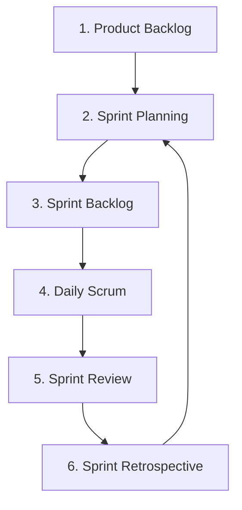
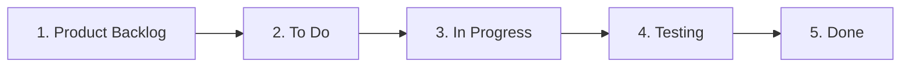

# Panduan Manajemen Proyek: Areta Sport Management
## Penerapan Metode Scrum dan Implementasi Trello Board

Dokumen ini menjelaskan kerangka kerja manajemen proyek yang digunakan dalam pengembangan aplikasi **Areta Sport Management** (berbasis Next.js, Firebase, dan Capacitor). Manajemen proyek ini mengombinasikan kelincahan metode **Scrum** dengan transparansi visual dari alat kolaborasi **Trello**.

---

## A. Metode Pengembangan Scrum

### 1. Pengertian Scrum
**Scrum** adalah salah satu kerangka kerja (*framework*) berbasis metodologi *Agile* yang dirancang untuk mengelola pengembangan produk yang kompleks secara adaptif, iteratif, dan inkremental. Scrum membagi siklus pengembangan menjadi unit-unit waktu kecil yang disebut **Sprint** (biasanya berdurasi 2 hingga 4 minggu). Fokus utama Scrum adalah memberikan nilai bisnis (*business value*) secara cepat dan berkelanjutan melalui kolaborasi tim yang erat, komunikasi harian, serta evaluasi rutin.

### 2. Alasan Memilih Scrum untuk Areta Sport Management
Penerapan Scrum dalam pengembangan **Areta Sport Management** didasarkan pada karakteristik proyek dan kebutuhan bisnis berikut:
* **Kebutuhan yang Dinamis & Terus Berkembang:** Fitur-fitur seperti *Sistem Pendukung Keputusan* (SPK) untuk pemilihan trainer, *QR Code/Barcode Scanner* untuk check-in anggota, serta modul laporan keuangan memerlukan eksperimen dan penyesuaian fungsionalitas secara berkala berdasarkan umpan balik pengguna.
* **Pengembangan Multi-Platform (Web & Mobile):** Mengingat Areta Sport Management menggunakan **Capacitor** untuk membungkus aplikasi web Next.js ke platform Android dan iOS, pengujian kompatibilitas platform harus dilakukan sesegera mungkin di setiap akhir Sprint untuk mendeteksi bug lebih awal.
* **Penyampaian Bertahap (*Incremental Delivery*):** Dibandingkan menunggu seluruh aplikasi selesai dalam waktu berbulan-bulan (pendekatan *Waterfall*), Scrum memungkinkan tim merilis fitur-fitur dasar (seperti autentikasi login dan manajemen anggota) terlebih dahulu, disusul fitur-fitur pelengkap di Sprint berikutnya.
* **Transparansi bagi Pemangku Kepentingan (*Stakeholders*):** Pemilik pusat kebugaran (*gym owner*) dapat memantau progres pengembangan fitur secara berkala melalui sesi demonstrasi di akhir setiap Sprint.

### 3. Tahapan Scrum dalam Proyek

#### 1. Product Backlog
Daftar prioritas dari semua fitur, perbaikan, dan kebutuhan teknis yang harus dibangun di dalam aplikasi Areta Sport Management. Daftar ini dikelola oleh *Product Owner* dan terus diperbarui sepanjang siklus hidup proyek.
* *Contoh Item:* Integrasi Firebase Auth, Modul QR Code Scanner Check-in, Sistem SPK Rekomendasi Trainer, Grafik Analitik Finansial.

#### 2. Sprint Planning
Pertemuan di awal setiap Sprint di mana seluruh Tim Scrum (Product Owner, Scrum Master, dan Developer) berkumpul untuk menentukan tujuan Sprint (*Sprint Goal*) dan memilih item dari Product Backlog yang paling mendesak serta realistis untuk diselesaikan dalam durasi Sprint berjalan (misalnya durasi 2 minggu).

#### 3. Sprint Backlog
Daftar tugas (*task list*) spesifik yang harus diselesaikan oleh tim developer selama Sprint aktif untuk mencapai *Sprint Goal*. Tugas-tugas ini merupakan hasil pemecahan (*breakdown*) teknis dari item Product Backlog yang telah dipilih saat *Sprint Planning*.
* *Contoh:* Membuat schema database Firestore untuk transaksi, membuat komponen UI scanner kamera, menguji integrasi Capacitor local notifications.

#### 4. Daily Scrum
Pertemuan singkat berdurasi maksimal 15 menit yang diadakan setiap hari selama Sprint berlangsung. Setiap anggota tim developer melaporkan tiga hal:
1. Apa yang telah diselesaikan kemarin?
2. Apa yang akan dikerjakan hari ini?
3. Apakah ada kendala atau hambatan (*blockers*) yang menghambat pekerjaan?

#### 5. Sprint Review
Pertemuan di akhir Sprint di mana tim developer mendemonstrasikan hasil fitur yang telah selesai dibangun (harus memenuhi kriteria *Definition of Done*) kepada *Product Owner* dan *Stakeholders*. Di sini, fungsionalitas seperti form transaksi baru atau cetak invoice PDF diuji dan diberikan umpan balik secara langsung.

#### 6. Sprint Retrospective
Pertemuan setelah *Sprint Review* dan sebelum *Sprint Planning* berikutnya, di mana tim merefleksikan proses kerja mereka sendiri. Tujuannya adalah mengidentifikasi hal-hal yang berjalan dengan baik, kendala yang dihadapi, serta menyusun rencana aksi nyata untuk meningkatkan efisiensi, komunikasi, dan kualitas kerja pada Sprint berikutnya.

---

## B. Implementasi Scrum Menggunakan Trello

### 1. Penjelasan Penggunaan Trello dalam Proyek
**Trello** digunakan sebagai representasi digital dari *Scrum Board*. Papan Kanban visual di Trello memudahkan seluruh anggota tim untuk melihat status setiap tugas secara *real-time*. 
* **Kartu (*Cards*):** Mewakili tugas spesifik atau user story (misalnya: "Integrasi Form Validasi Zod pada CRUD Member"). Setiap kartu berisi deskripsi tugas, penanggung jawab (*assignee*), tenggat waktu (*due date*), daftar tugas (*checklist*), dan lampiran dokumen penunjang.
* **Label:** Digunakan untuk kategorisasi platform atau jenis tugas (misalnya: label hijau untuk `Front-End`, biru untuk `Back-End/Firebase`, ungu untuk `Mobile/Capacitor`, dan merah untuk `Urgent Bug`).

### 2. Struktur Board Trello yang Digunakan

Papan Trello proyek **Areta Sport Management** disusun ke dalam 5 kolom (*lists*) utama yang mencerminkan alur kerja pengembangan:

#### 1. Product Backlog
Kolom ini menampung seluruh ide, fitur, perbaikan bug, dan persyaratan teknis aplikasi Areta Sport Management yang direncanakan untuk dibangun di masa mendatang. Kartu-kartu di kolom ini diurutkan dari yang paling prioritas di bagian atas.
* *Contoh Kartu:*
  * `[Feature] Autentikasi Pengguna & Reset Password (Firebase Auth)`
  * `[Feature] Manajemen Data Anggota (CRUD Members & Paket Latihan)`
  * `[Feature] Scanner Barcode/QR Code Check-in Anggota (HTML5-QRCode)`
  * `[Feature] Manajemen Inventaris Alat Fitnes (Equipment)`
  * `[Feature] Dashboard Analitik Ringkasan Bisnis (Recharts)`
  * `[Feature] Modul Pencatatan Transaksi & Riwayat Pembayaran (Transactions)`
  * `[Feature] Modul Laporan Pengeluaran (Expenses) & Cetak PDF (jspdf)`
  * `[Feature] Sistem Pendukung Keputusan (SPK) Pemilihan Trainer Terbaik`
  * `[Feature] Fitur Chat/Konsultasi Member dengan Trainer (Zustand State)`

#### 2. To Do (Sprint Backlog)
Kolom ini berisi daftar tugas yang disepakati untuk dikerjakan pada Sprint aktif. Kartu di kolom ini dipindahkan dari kolom *Product Backlog* saat sesi *Sprint Planning*. Tugas didekonstruksi menjadi unit yang lebih spesifik.
* *Contoh Kartu:*
  * `[UI] Desain Halaman Riwayat Transaksi & Layout Responsif`
  * `[Integration] Integrasi Capacitor Camera API untuk fitur scan QR`
  * `[DB] Konfigurasi Aturan Keamanan (Security Rules) Firestore untuk Koleksi Members`

#### 3. In Progress
Kolom untuk kartu tugas yang saat ini sedang aktif dikerjakan oleh developer. Setiap developer memindahkan kartu ke kolom ini dan menyematkan foto profil mereka (*assignee*) agar tidak ada tumpang tindih pengerjaan.
* *Contoh Kartu:*
  * `[Dev] Implementasi State Management Zustand untuk Keranjang Transaksi Credits`
  * `[Dev] Penulisan Query SPK Rekomendasi Trainer Menggunakan Firebase Firestore SDK`

#### 4. Testing
Berisi kartu tugas yang kodenya telah selesai ditulis oleh developer dan sedang berada dalam tahap pengujian. Pengujian mencakup unit testing, verifikasi UI oleh designer, serta pengujian kompatibilitas pada emulator Android dan iOS (Capacitor wrapper).
* *Contoh Kartu:*
  * `[QA] Pengujian fungsionalitas unduh laporan bulanan PDF (jspdf-autotable)`
  * `[QA] Verifikasi pengiriman email tautan reset password halaman Login`

#### 5. Done
Tempat penampungan kartu tugas yang telah sepenuhnya selesai, lulus pengujian QA, disetujui oleh *Product Owner*, dan siap digabungkan (*merge*) ke cabang utama (*main/production branch*) aplikasi.
* *Contoh Kartu:*
  * `[System] Inisialisasi Project Next.js 15 dengan Tailwind CSS`
  * `[System] Setup SDK Firebase dan Firebase Admin SDK`
